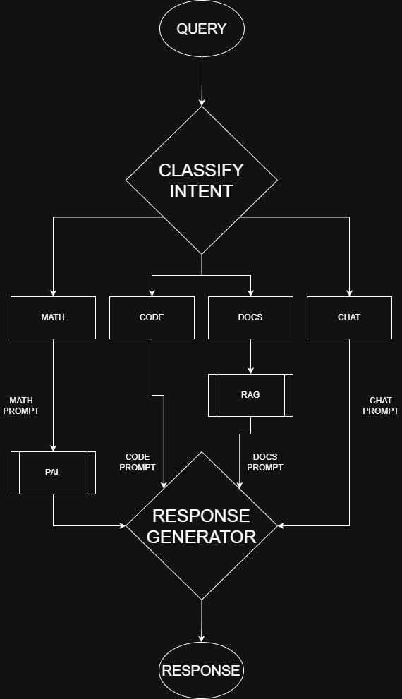
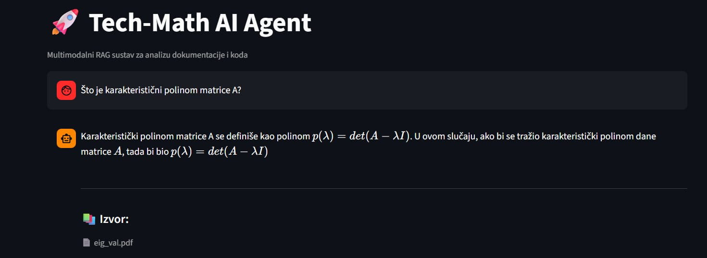
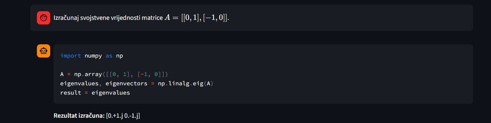
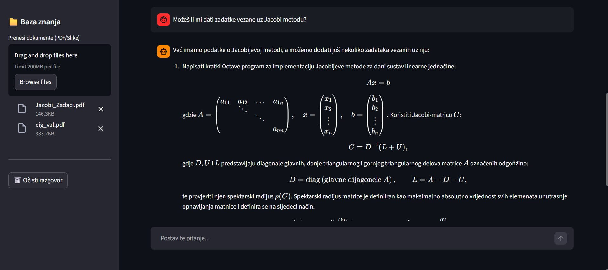

# Tech-Math AI Agent: A Hybrid RAG and PAL Framework

**Tech-Math AI Agent** is an advanced Natural Language Processing (NLP) system designed as a specialized assistant for technical and mathematical environments. The project implements a hybrid architecture that combines **Retrieval-Augmented Generation (RAG)** for factual documentation queries and **Program-Aided Language (PAL)** for deterministic mathematical problem-solving.

## Table of Contents
* [1. Project Overview](#1-project-overview)
* [2. Technical Architecture](#2-technical-architecture)
* [3. Technical Specifications](#3-technical-specifications)
* [4. Implementation Stack](#4-implementation-stack)
* [5. Project Structure](#5-project-structure)
* [6. Usage and Installation](#6-usage-and-installation)

## 1. Project Overview
The primary objective of this project is to develop a local, privacy-preserving AI agent capable of handling complex technical tasks without reliance on third-party APIs. It addresses the inherent limitations of standard Large Language Models (LLMs)—specifically "hallucinations" in mathematical calculations—by offloading symbolic logic to a Python execution environment.

## 2. Technical Architecture
The agent operates through a multi-stage pipeline:



### 2.1. Intent Classification (Few-Shot Prompting)
Rather than relying on simple keyword matching, the system utilizes **Few-Shot In-Context Learning**. By providing the model with curated examples of `MATH`, `CODE`, `DOCS`, and `CHAT` intents, the agent achieves high precision in routing queries to the appropriate specialized processing branch.

### 2.2. Documentation Retrieval (RAG)
For the `DOCS` intent, the system employs:
* **Vector Database**: FAISS (Facebook AI Similarity Search) for efficient similarity indexing.
* **Semantic Search**: Utilizes multilingual embeddings to support technical queries in Croatian.
* **Contextual Injection**: Relevant document chunks are retrieved and injected into the system prompt to ensure responses are grounded in provided technical literature.



### 2.3. Mathematical Execution (PAL)
When a `MATH` intent is detected, the agent follows the **Program-Aided Language (PAL)** paradigm:
1.  Generates optimized Python code (utilizing specialized libraries like NumPy or Pandas).
2.  Executes the code in an isolated environment.
3.  Returns the calculated result, ensuring 100% numerical accuracy and avoiding common LLM arithmetic errors.



## 3. Technical Specifications

### 3.1. Model Selection
* **Generator and Intent Classification Model**: `unsloth/mistral-7b-instruct-v0.3-bnb-4bit`
    * An optimized version of Mistral-7B, utilizing 4-bit quantization to fit within consumer-grade GPU memory (6GB VRAM) while maintaining high reasoning capabilities.
* **Embedding Model**: `intfloat/multilingual-e5-small`
    * A high-efficiency multilingual model used to transform text into 384-dimensional vectors, ensuring high-quality document retrieval in the RAG pipeline.

### 3.2. Hardware & Optimization
To facilitate local deployment on academic hardware, the following optimizations are implemented:
* **4-bit Quantization (NF4)**: Reduces the memory footprint of the 7B model significantly using `bitsandbytes`.
* **SDPA (Scaled Dot Product Attention)**: An optimized attention mechanism for faster inference and lower memory overhead.
* **Device Management**: Native support for `CUDA` acceleration with automatic fallback to `CPU`.


### 3.3. Data Pipeline Configurations
As defined in `common/config.py`, the system adheres to the following parameters:
* **Chunking Strategy**: 500-character blocks with 180-character overlap for context preservation.
* **Retrieval Depth**: `TOP_K_RESULTS = 2` for precise context extraction.
* **Vector Dimension**: 384 (aligned with the E5-Small architecture).

## 4. Implementation Stack
* **Core Framework**: PyTorch
* **Model Management**: HuggingFace Transformers & Accelerate
* **Vector Search Engine**: FAISS
* **Quantization**: BitsAndBytes (4-bit precision)
* **Mathematical Environment**: Python (NumPy, Pandas)

## 5. Project Structure

The repository is organized into modular components to ensure a clear separation between the intent detection logic, the execution environments, and the storage layers.

```text
├── assets/                 # Documentation images and UI screenshots
├── src/
│   ├── common/             # Global configurations and model parameters
│   ├── core/               # Core AI Logic
│   │   ├── embedder.py     # Vector embedding generation (E5-small)
│   │   ├── engine.py       # Intent classification and decision orchestration
│   │   ├── generator.py    # Mistral-7B inference and PAL code generation
│   │   ├── search.py       # Semantic search logic for RAG
│   │   └── vector_store.py # FAISS index management
│   ├── data/               # Data loading and processing scripts
│   ├── preprocessing/      # PDF parsing and text cleaning
│   ├── utils/              # Helper functions (logging, LaTeX formatting)
│   ├── app.py              # Main Streamlit UI and application entry point
│   └── requirements.txt    # Project dependencies
└── README.md               # Project documentation
```

## 6. Usage and Installation

### 6.1. Environment Setup
The project environment is managed via a comprehensive dependency list. To set up the environment, ensure you have **Python 3.10+** and (optionally) a **CUDA-capable GPU**, then run:


*For Linux/macOS:*
```bash
# Navigate to your project directory
# Create a Python virtual environment
python3 -m venv venv

# Activate the environment
source venv/bin/activate

# Install dependencies
pip install -r requirements.txt
```

*For Windows:*
```bash
# Navigate to your project directory in PowerShell or Command Prompt
# Create a Python virtual environment
python -m venv venv

# Activate the environment
.\venv\Scripts\activate

# Install dependencies
pip install -r requirements.txt
```

---

### 6.2. Document Indexing and UI Usage

The agent provides a unified **Streamlit User Interface** that handles data ingestion and interaction within a single workflow. No manual execution of indexing scripts is required.

#### Launch the Application

Start the Streamlit interface using:

```bash
streamlit run app.py
```

#### Upload Documents

Use the **Upload** feature inside the Streamlit interface to provide your technical PDF or text files.

#### Background Processing

After uploading files, the system automatically performs:

- Text extraction  
- Document chunking  
- Embedding generation  
- FAISS vector indexing  

All processing occurs in the background without user intervention.

#### Querying

Once indexing is complete, the agent is ready to:

- Answer documentation-based queries using **RAG**
- Solve mathematical problems using **PAL**
- Handle general technical or conversational queries



---

### 6.3. Configuration

Hardware and runtime settings can be configured inside:

```
common/config.py
```

#### Device Selection

By default, the system automatically selects the optimal device:

- Uses `DEVICE = "cuda"` if a compatible NVIDIA GPU is detected  
- Falls back to `DEVICE = "cpu"` if GPU acceleration is unavailable  

Users may manually override this behavior by modifying the configuration file.
